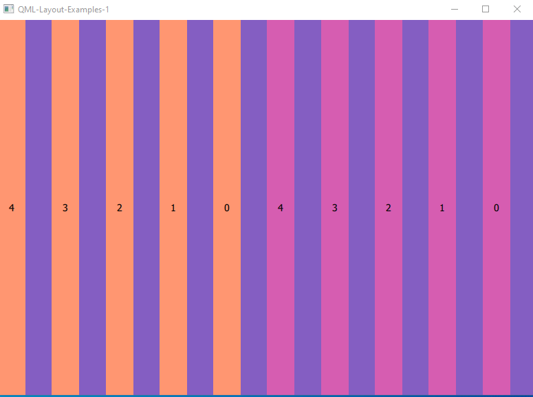
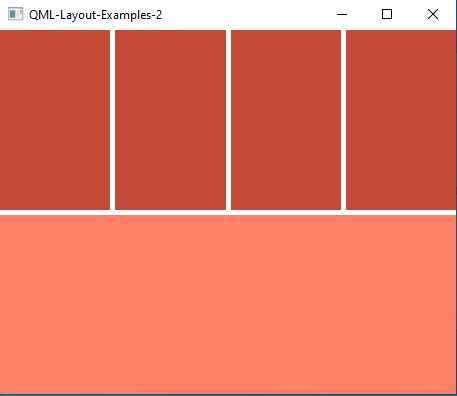
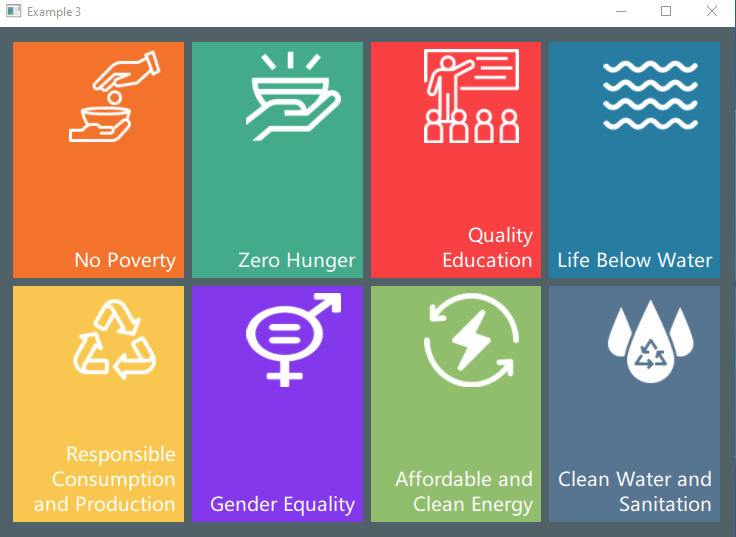

# QML-Examples

This repo has small code samples that I developed while learning QML. You can find images and explanations about related codes in each file. Let's have fun!

# Layout 1

# Layout 2

# Layout 3

